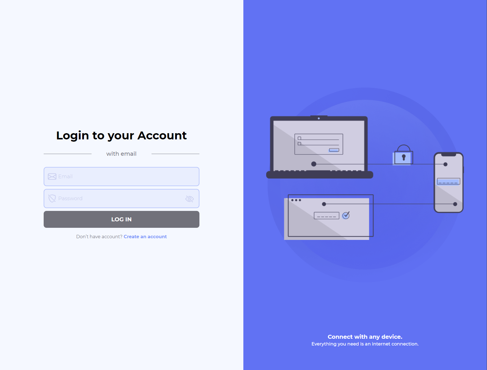

# Nuxt 3 auth app with TS & Tailwind CSS

**[Ссылка на приложение/Link on app](https://den-dev97.github.io/auth/ "auth app")**
*** 
* Приложение имеет 3 страницы - index / sign-up / otp.
* Запросы к апи осуществляются на https://dummyjson.com/auth/login.
* Тестовые данные для входа: atuny0 / 9uQFF1Lh
* На странице Signup при введенных данных и попытке смены роута приложение не пускает на страницу login’a, задает вопрос пользователю, что все данные могут быть потеряны.
* На странице OTP отображается введенный ранее email при нажатии на change Email возвращаемся на предыдущую страницу.
* Состояние формы реализовано на Pinia.
* При наведении на правую часть экрана - картинка немного отклоняется от текущего положения.
* При введении OTP автоматически переключается input.
* В приложении используется модульный подход, картинки оптимизированы
***
* The application consists of 3 pages - index / sign-up / otp.
* API requests are made to https://dummyjson.com/auth/login.
* Test login details : atuny0 / 9uQFF1Lh
* On the Signup page, when data is entered and there's an attempt to change the route, the application prevents navigation to the login page, prompting the user that all data may be lost.
* On the OTP page, the previously entered email is displayed. Clicking on "change Email" returns the user to the previous page.
* The form state is implemented using Pinia.
* When hovering over the right side of the screen, the image slightly deviates from its current position.
* When entering the OTP, the input field automatically switches.
* The application utilizes a modular approach, and images are optimized.

---

